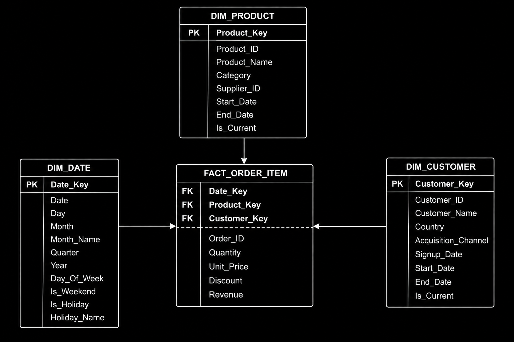

# E-Commerce Sales & Customer Behavior Dimensional Model (Star Schema)

## Problem Overview
Dimensional data warehouse architecture for an enterprise e-commerce platform (e.g., Shopify, Amazon). Designed specifically for marketing, inventory, and executive analytics teams to track sales performance, customer purchasing behavior, holiday campaign efficacy, repeat buyer retention, and geographic revenue distributions across high-volume transactions (1M+ customers, 100k+ products, 5+ years of historical data).

## Grain & Design Decisions
- **Declared Grain:** One row per individual order-item line within a customer order (`fact_order_item`).
- **Degenerate Dimension (`order_id`):** Preserved directly in the fact table without a separate order dimension to enable transaction grouping, average basket calculation, and operational auditability.
- **Slowly Changing Dimensions (SCD Type 2):** Implemented in `dim_product` and `dim_customer` using surrogate keys (`product_key`, `customer_key`), effective date ranges (`start_date`, `end_date`), and active flags (`is_current`) to accurately track product renames and customer relocations over time.
- **Date Dimension (`dim_date`):** Enriched with fiscal/calendar hierarchies, weekend flags, and holiday attributes (`is_holiday`, `holiday_name`) to isolate seasonal demand (where holidays represent ~40% of annual revenue).

## 1. Star Schema Architecture

## Schema Architecture

The dimensional model consists of 4 core tables (1 fact table and 3 dimension tables):

| Table Name | Type | Description | Key Attributes |
| :--- | :--- | :--- | :--- |
| **`dim_product`** | Dimension (SCD Type 2) | Product catalog dimension with historical revision tracking | `product_key` (PK), `product_id`, `product_name`, `category`, `supplier_id`, `start_date`, `end_date`, `is_current` |
| **`dim_customer`** | Dimension (SCD Type 2) | Master customer profiles, geographic location, and acquisition channels | `customer_key` (PK), `customer_id`, `customer_name`, `country`, `acquisition_channel`, `signup_date`, `start_date`, `end_date`, `is_current` |
| **`dim_date`** | Dimension | Calendar dimension with temporal hierarchies and holiday metadata | `date_key` (PK), `date`, `day`, `month`, `month_name`, `quarter`, `year`, `day_of_week`, `is_weekend`, `is_holiday`, `holiday_name` |
| **`fact_order_item`** | Fact (Transactional) | Item-level sales facts, additive measures, and foreign key references | `order_id` (Degenerate), `product_key` (FK), `customer_key` (FK), `date_key` (FK), `quantity`, `unit_price`, `discount`, `revenue` |

## Key Business Queries
All SQL solutions are in [`Business_Solution.sql`](Business_Solution.sql):

1. **Monthly Revenue by Product Category:** Aggregates total net revenue generated per product category for specific calendar months.
2. **Customer Lifetime Value & Acquisition Channel:** Identifies highest-value customers ranked by total spend alongside the marketing channel that acquired them.
3. **Holiday vs. Regular Day Product Demand:** Evaluates product quantity sold during recognized holidays versus regular shopping days.
4. **Average Order Size by Country:** Calculates average order transaction value across international markets using order-level aggregation.
5. **First-Time vs. Repeat Buyer Analysis:** Analyzes product purchase distributions segmented by customer cohort (first-time purchase vs. repeat retention).
