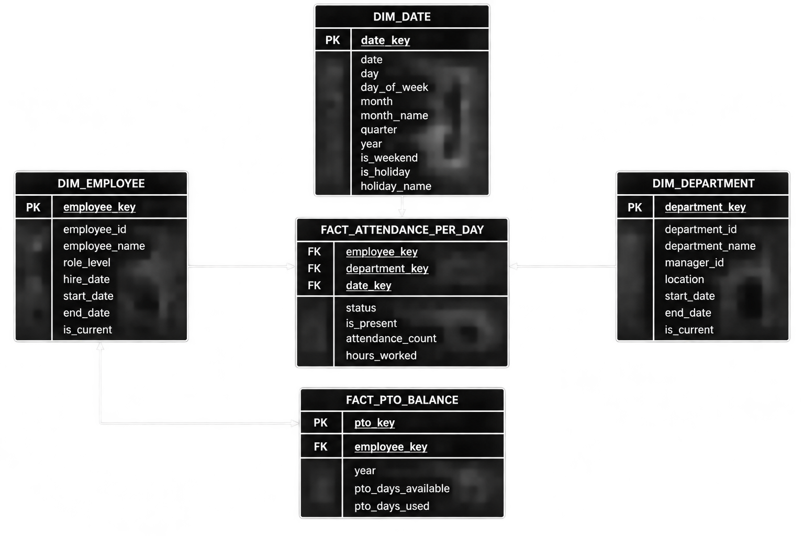

# HR Attendance & Workforce Analytics Dimensional Model (Star Schema)

## Problem Overview
Dimensional data warehouse architecture for an enterprise HR operations and workforce analytics platform (10,000+ employees across 50+ departments and multiple global office locations, 3+ years of historical data). Designed specifically for HR leaders, department managers, and workforce operations teams to monitor daily attendance patterns, evaluate employee absenteeism and punctuality, track PTO accruals versus utilization, and analyze seasonal workforce attendance trends across office locations and role levels.

## Grain & Design Decisions
- **Declared Grain:** One row per employee per working day in the primary fact table (`fact_attendance_per_day`).
- **Periodic Snapshot Fact (`fact_pto_balance`):** Tracks annual PTO allocations, days used, and remaining balances per employee (`pto_days_available`, `pto_days_used`).
- **Slowly Changing Dimensions (SCD Type 2):** Implemented in `dim_employee` and `dim_department` using surrogate keys (`employee_key`, `department_key`), effective date ranges (`start_date`, `end_date`), and active flags (`is_current`) to accurately capture employee promotions, department transfers, manager changes, and office relocations over time.
- **Date Dimension (`dim_date`):** Enriched with temporal hierarchies, day-of-week attributes, weekend flags (`is_weekend`), and holiday metadata (`is_holiday`, `holiday_name`) to normalize global workforce calendars and isolate seasonal attendance shifts (summer months vs. holiday periods).
- **Numerical Attendance Metrics & Additive Measures:** Stores `is_present` (binary flag: `1` for present, `0` for absent/PTO) and `attendance_count` (baseline scheduled day: `1`) to enable simple additive aggregation of attendance rates (`SUM(is_present) * 100.0 / SUM(attendance_count)`), alongside `hours_worked` as an additive measure for total logged working hours.

## 1. Star Schema Architecture

## Schema Architecture

The dimensional model consists of 5 core tables (2 fact tables and 3 dimension tables):

| Table Name | Type | Description | Key Attributes |
| :--- | :--- | :--- | :--- |
| **`dim_employee`** | Dimension (SCD Type 2) | Master employee profiles, role seniority, and hire metadata | `employee_key` (PK), `employee_id`, `employee_name`, `role_level`, `hire_date`, `start_date`, `end_date`, `is_current` |
| **`dim_department`** | Dimension (SCD Type 2) | Departmental hierarchy, managerial assignments, and office locations | `department_key` (PK), `department_id`, `department_name`, `manager_id`, `location`, `start_date`, `end_date`, `is_current` |
| **`dim_date`** | Dimension | Calendar dimension with temporal hierarchies and global holiday metadata | `date_key` (PK), `date`, `day`, `day_of_week`, `month`, `month_name`, `quarter`, `year`, `is_weekend`, `is_holiday`, `holiday_name` |
| **`fact_attendance_per_day`** | Fact (Daily Transactional) | Daily employee attendance records, presence status flags, and logged hours | `employee_key` (FK), `department_key` (FK), `date_key` (FK), `status`, `is_present`, `attendance_count`, `hours_worked` |
| **`fact_pto_balance`** | Fact (Periodic Snapshot) | Periodic PTO balances tracking allocated available days vs. days used | `pto_key` (PK), `employee_key` (FK), `year`, `pto_days_available`, `pto_days_used` |

## Key Business Queries
All SQL solutions are in [`Business_Solution.sql`](Business_Solution.sql):

1. **Monthly Attendance Rate by Department:** Computes attendance percentages (`SUM(is_present) / SUM(attendance_count)`) aggregated by department and month.
2. **PTO Utilization vs. Available Days:** Compares total PTO days consumed against allocated balances per employee and department to monitor leave burn rates.
3. **Frequent Absences and Chronic Lateness:** Identifies employees with the highest frequency of unexcused absences or late arrivals.
4. **Attendance Patterns by Location & Role Level:** Evaluates attendance rates and average hours worked segmented across different office locations and seniority levels.
5. **Seasonal Attendance Trends (Holidays vs. Summer):** Analyzes workforce attendance fluctuations and time-off distributions during holiday seasons versus summer months.
