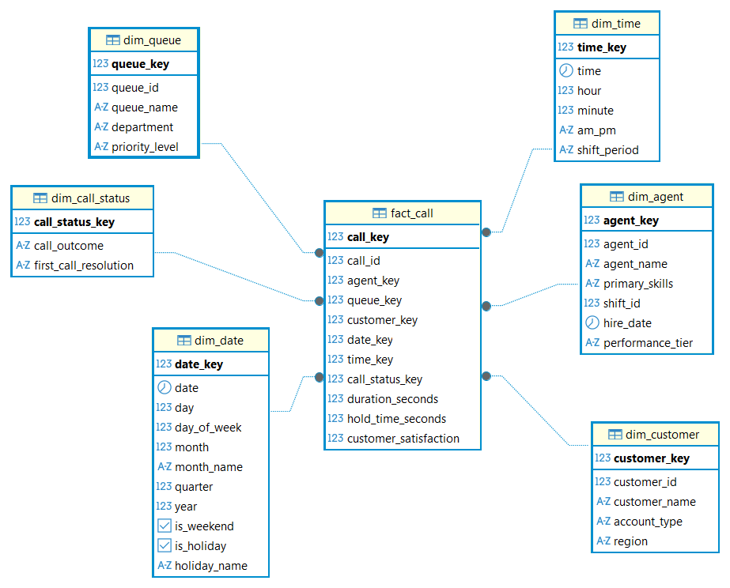

# Call Center Operations & Quality Analytics Dimensional Model (Star Schema)

## Problem Overview
Dimensional data warehouse architecture for an enterprise call center and customer service platform (e.g., Amazon Customer Service, Zendesk, Genesys). Designed for call center directors, operations managers, shift supervisors, and quality assurance (QA) coaches to monitor real-time queue congestion, evaluate agent resolution efficiency, track customer satisfaction (CSAT) scores, identify coaching requirements, and analyze long-term service quality across large-scale support operations (5,000+ agents across multiple locations, 100+ queues organized by department and priority, and 100K+ daily inbound/outbound calls).

## Grain & Design Decisions
- **Declared Grain:** One row per individual customer call interaction in the primary fact table (`fact_call`).
- **Junk Dimension (`dim_call_status`):** Combines low-cardinality categorical indicators and disposition flags (`call_outcome`: `resolved`, `escalated`, `callback`, `abandoned`; `first_call_resolution`: `yes`, `no`) into a single compact junk dimension. This eliminates repetitive text columns from the high-velocity fact table (100K+ rows/day), maximizing columnar compression and query performance.
- **Slowly Changing Dimensions (SCD Type 1):** Implemented in `dim_agent` where attributes such as `primary_skills` and `performance_tier` are updated and overwritten in-place without maintaining historical versions, fulfilling management's requirement for current-state agent reporting.
- **Dual Temporal Dimensions (`dim_date` & `dim_time`):** Decouples calendar date hierarchies (`date_key`) from minute-level time-of-day attributes (`time_key`, `hour`, `minute`, `shift_period`, `am_pm`). This supports both real-time intra-day active shift monitoring and multi-year historical trend reporting.
- **Additive vs. Non-Additive Measures:**
  - `duration_seconds` & `hold_time_seconds`: Fully additive measures across all dimensions (can be summed to determine total queue handle/wait time or averaged across agents and queues).
  - `customer_satisfaction`: Non-additive / Semi-additive metric (discrete 1–5 scale rating) modeled for average aggregation (`round(avg(customer_satisfaction), 2)`) and distribution filtering.

## 1. Star Schema Architecture

## Schema Architecture

The dimensional model consists of 7 core tables (1 fact table and 6 dimension tables):

| Table Name | Type | Description | Key Attributes |
| :--- | :--- | :--- | :--- |
| **`dim_agent`** | Dimension (SCD Type 1) | Master call center agent profiles, primary skills, shift assignments, and current performance tier | `agent_key` (PK), `agent_id`, `agent_name`, `primary_skills`, `shift_id`, `hire_date`, `performance_tier` |
| **`dim_queue`** | Dimension | Call queues segmented by department, skill group, and priority level | `queue_key` (PK), `queue_id`, `queue_name`, `department`, `priority_level` |
| **`dim_customer`** | Dimension | Customer profile dimension capturing account classifications and geographic regions | `customer_key` (PK), `customer_id`, `customer_name`, `account_type`, `region` |
| **`dim_date`** | Dimension | Calendar dimension with temporal hierarchies, day-of-week attributes, weekend flags, and holiday metadata | `date_key` (PK), `date`, `day`, `day_of_week`, `month`, `month_name`, `quarter`, `year`, `is_weekend`, `is_holiday`, `holiday_name` |
| **`dim_time`** | Dimension | Time-of-day dimension with hour, minute, AM/PM, and operational shift periods | `time_key` (PK), `time`, `hour`, `minute`, `am_pm`, `shift_period` |
| **`dim_call_status`** | Junk Dimension | Low-cardinality junk dimension combining call outcome dispositions and first-call resolution indicators | `call_status_key` (PK), `call_outcome`, `first_call_resolution` |
| **`fact_call`** | Fact (Transactional) | Call-level interaction facts, handle/hold duration measures, customer satisfaction ratings, and foreign keys | `call_key` (PK), `call_id` (Degenerate), `agent_key` (FK), `queue_key` (FK), `customer_key` (FK), `date_key` (FK), `time_key` (FK), `call_status_key` (FK), `duration_seconds`, `hold_time_seconds`, `customer_satisfaction` |

## Key Business Queries
All SQL solutions are in [`Business_Solution.sql`](Business_Solution.sql):

1. **Agent Call Duration & CSAT by Queue:** Evaluates average call handle duration and customer satisfaction score grouped by agent and queue.
2. **First Call Resolution (FCR) & Escalation Rates:** Analyzes total call volume, first-call resolution rate (`%`), callback volume, and escalation frequency per agent.
3. **Hold Time Impact on Satisfaction Scores:** Evaluates the correlation between extended hold times (≥ 120s vs. short hold) and customer satisfaction ratings.
4. **Queue Congestion, Wait Times & Abandonment Rate:** Identifies queues experiencing severe backlogs based on longest average hold times and highest call abandonment percentages.
5. **Agent Performance Coaching Trigger Detection:** Programmatically flags agents requiring coaching based on multi-criteria thresholds (low FCR < 50%, low CSAT < 3, or excessive average hold time > 150s).
