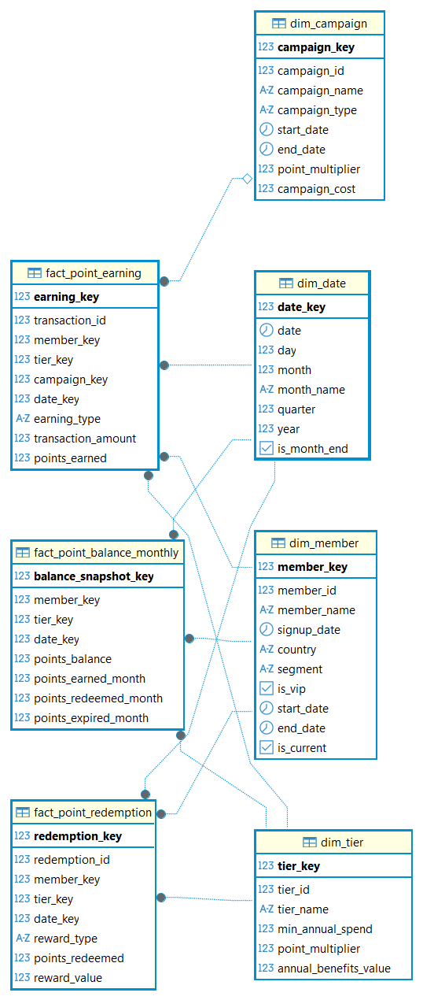

# Customer Loyalty & Rewards Program Dimensional Model (Star Schema)

## Problem Overview
Dimensional data warehouse architecture for an enterprise customer loyalty and rewards program (e.g., Starbucks Rewards, Marriott Bonvoy, Delta SkyMiles). Designed specifically for marketing, CRM, loyalty operations, and executive analytics teams to track point accruals, reward redemptions, tier progression (Silver -> Gold -> Platinum), campaign attribution and ROI, member lifecycle segment transitions, and point expiration liabilities across millions of active members and high-velocity transactional events.

## Grain & Design Decisions
- **Declared Grains:**
  - **Earning Transaction Fact (`fact_point_earning`):** One row per individual point-earning transaction or purchase event.
  - **Redemption Transaction Fact (`fact_point_redemption`):** One row per individual reward redemption event.
  - **Monthly Periodic Snapshot Fact (`fact_point_balance_monthly`):** One row per loyalty member per calendar month-end snapshot.
- **Semi-Additive vs. Fully Additive Measures:**
  - `points_balance`: Semi-additive measure — valid to sum across all members at a specific snapshot point in time (`sum(points_balance)` at month-end), but **cannot** be summed across multiple time periods.
  - `points_earned_month`, `points_redeemed_month`, and `points_expired_month`: Fully additive measures across both dimensional attributes and time hierarchies.
- **Point Expiration Policy (12 Months):** Points expire 12 months after earning, tracked monthly in `points_expired_month` to measure outstanding balance runoff and liability reduction.
- **Slowly Changing Dimensions (SCD Type 2):** Implemented in `dim_member` using surrogate keys (`member_key`), effective date ranges (`start_date`, `end_date`), and active flags (`is_current`) to capture member lifecycle transitions (`new` -> `active` -> `dormant` -> `churned`) and VIP status upgrades over time without losing historical context.
- **Tier Progression:** `dim_tier` captures annual spending thresholds (`min_annual_spend`), earning accelerators (`point_multiplier`), and annual benefit values to evaluate member upgrade/downgrade behavior and spend lift.
- **Campaign Attribution & ROI:** `dim_campaign` tracks promotional events (`Double Points`, `Holiday Promo`, `Bonus Multiplier`, `Reactivation`) and campaign costs, linked directly to earning events to calculate marketing campaign ROI and incremental member spending.
- **Conformed Date Dimension (`dim_date`):** Standard enterprise calendar dimension with year, quarter, month, day, month-name hierarchies, and month-end indicator flags (`is_month_end`).

## 1. Star Schema Architecture

## Schema Architecture

The dimensional model consists of 7 core tables (3 fact tables and 4 dimension tables):

| Table Name | Type | Description | Key Attributes |
| :--- | :--- | :--- | :--- |
| **`dim_member`** | Dimension (SCD Type 2) | Member profile, country, lifecycle segment (`new`, `active`, `dormant`, `churned`), and VIP status | `member_key` (PK), `member_id`, `member_name`, `signup_date`, `country`, `segment`, `is_vip`, `start_date`, `end_date`, `is_current` |
| **`dim_tier`** | Dimension | Loyalty tiers with annual spending thresholds, points multipliers, and annual benefit values | `tier_key` (PK), `tier_id`, `tier_name`, `min_annual_spend`, `point_multiplier`, `annual_benefits_value` |
| **`dim_campaign`** | Dimension | Marketing and promotional campaigns, bonus multipliers, date ranges, and campaign costs | `campaign_key` (PK), `campaign_id`, `campaign_name`, `campaign_type`, `start_date`, `end_date`, `point_multiplier`, `campaign_cost` |
| **`dim_date`** | Dimension | Calendar dimension with temporal hierarchies and month-end flags | `date_key` (PK), `date`, `day`, `month`, `month_name`, `quarter`, `year`, `is_month_end` |
| **`fact_point_earning`** | Fact (Transactional) | Individual point-earning transaction records, transaction amounts, and points awarded | `earning_key` (PK), `transaction_id` (Degenerate), `member_key` (FK), `tier_key` (FK), `campaign_key` (FK), `date_key` (FK), `earning_type`, `transaction_amount`, `points_earned` |
| **`fact_point_redemption`** | Fact (Transactional) | Reward redemption events, redemption point values, and monetary discount worth | `redemption_key` (PK), `redemption_id` (Degenerate), `member_key` (FK), `tier_key` (FK), `date_key` (FK), `reward_type`, `points_redeemed`, `reward_value` |
| **`fact_point_balance_monthly`** | Fact (Periodic Snapshot) | Monthly snapshot of member points balances, points earned, redeemed, and expired | `balance_snapshot_key` (PK), `member_key` (FK), `tier_key` (FK), `date_key` (FK), `points_balance`, `points_earned_month`, `points_redeemed_month`, `points_expired_month` |

## Key Business Queries
All SQL solutions are in [`Business_Solution.sql`](Business_Solution.sql):

1. **Total Points Balance at Month-End:** Computes total active point liabilities across all members at month-end snapshot dates (demonstrating semi-additive aggregation).
2. **Monthly Points Flow (Earned vs. Redeemed vs. Expired):** Analyzes the monthly velocity of points earned, redeemed, and expired to monitor net point liability fluctuations.
3. **Campaign Engagement & Revenue ROI:** Measures transaction count, points awarded, and total transaction spend generated per promotional campaign.
4. **Member Spending by Loyalty Tier:** Compares total member spending, active member count, and points earned across loyalty tiers to evaluate tier progression impact.
5. **Member Lifetime Value (LTV) by Segment & Tier:** Computes cumulative customer spend and points accumulation segmented by current member lifecycle status and tier using SCD Type 2 filtering.
